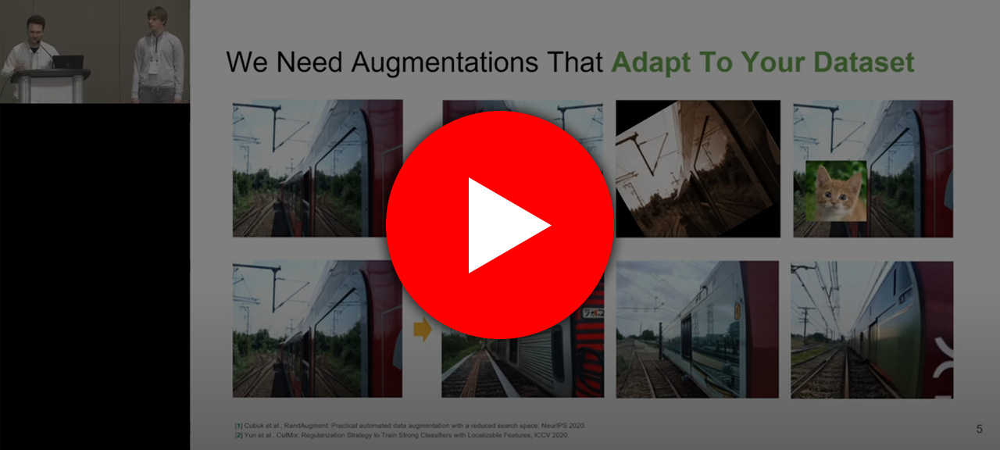

# Effective Data Augmentation With Diffusion Models

[](https://www.youtube.com/watch?v=IKDWOOWzwns)

Watch our talk for a quick introduction!

Data augmentation is one of the most prevalent tools in deep learning, underpinning many recent advances. The standard approach to data augmentation combines simple transformations like rotations and flips to generate new images from existing ones. However, current augmentations cannot alter the high-level semantic attributes, such as animal species present in a scene, to enhance the diversity of data. We improve diversity in data augmentation with image-to-image transformations parameterized by pre-trained text-to-image diffusion models. Our method edits images using an off-the-shelf diffusion model, and generalizes to novel visual concepts from a few labelled examples.

[ICLR 2024 Manuscript](https://openreview.net/forum?id=ZWzUA9zeAg)    |    [Site](btrabuc.co/da-fusion)    |    [Leafy Spurge Dataset](leafy-spurge-dataset.github.io)

## Installation

To install the package, first create a `conda` environment.

```bash
conda create -n da-fusion python=3.7 pytorch==1.12.1 torchvision==0.13.1 cudatoolkit=11.6 -c pytorch
conda activate da-fusion
pip install diffusers["torch"] transformers pycocotools pandas matplotlib seaborn scipy
```

Then download and install the source code.

```bash
git clone git@github.com:brandontrabucco/da-fusion.git
pip install -e da-fusion
```

## Datasets

We benchmark DA-Fusion on few-shot image classification problems, including a Leafy Spurge weed recognition task, and classification tasks derived from COCO and PASCAL VOC. For the latter two, we label images with the classes corresponding to the largest object in the image.

Custom datasets can be evaluated by implementing subclasses of `semantic_aug/few_shot_dataset.py`.

## Setting Up PASCAL VOC

Data for the PASCAL VOC task is adapted from the [2012 PASCAL VOC Challenge](http://host.robots.ox.ac.uk/pascal/VOC/voc2012/VOCtrainval_11-May-2012.tar). Once this dataset has been downloaded and extracted, the PASCAL dataset class `semantic_aug/datasets/pascal.py` should be pointed to the downloaded dataset via the `PASCAL_DIR` config variable located [here](https://github.com/brandontrabucco/da-fusion/blob/main/semantic_aug/datasets/pascal.py#L14).

Ensure that `PASCAL_DIR` points to a folder containing `ImageSets`, `JPEGImages`, `SegmentationClass`, and `SegmentationObject` subfolders.

## Setting Up COCO

To setup COCO, first download the [2017 Training Images](http://images.cocodataset.org/zips/train2017.zip), the [2017 Validation Images](http://images.cocodataset.org/zips/val2017.zip), and the [2017 Train/Val Annotations](http://images.cocodataset.org/annotations/annotations_trainval2017.zip). These files should be unzipped into the following directory structure.

```
coco2017/
    train2017/
    val2017/
    annotations/
```

`COCO_DIR` located [here](https://github.com/brandontrabucco/da-fusion/blob/main/semantic_aug/datasets/coco.py#L15) should be updated to point to the location of `coco2017` on your system.

## Setting Up The Spurge Dataset

We are planning to release this dataset in the next few months. Check back for updates!

## Fine-Tuning Tokens

We perform textual inversion (https://arxiv.org/abs/2208.01618) to adapt Stable Diffusion to the classes present in our few-shot datasets. The implementation in `fine_tune.py` is adapted from the [Diffusers](https://github.com/huggingface/diffusers/blob/main/examples/textual_inversion/textual_inversion.py) example. 

We wrap this script for distributing experiments on a slurm cluster in a set of `sbatch` scripts located at `scripts/fine_tuning`. These scripts will perform multiple runs of Textual Inversion in parallel, subject to the number of available nodes on your slurm cluster.

If `sbatch` is not available in your system, you can run these scripts with `bash` and manually set `SLURM_ARRAY_TASK_ID` and `SLURM_ARRAY_TASK_COUNT` for each parallel job (these are normally set automatically by slurm to control the job index, and the number of jobs respectively, and can be set to 0, 1).

## Few-Shot Classification

Code for training image classification models using augmented images from DA-Fusion is located in `train_classifier.py`. This script accepts a number of arguments that control how the classifier is trained:

```bash
python train_classifier.py --logdir pascal-baselines/textual-inversion-0.5 \
--synthetic-dir "aug/textual-inversion-0.5/{dataset}-{seed}-{examples_per_class}" \
--dataset pascal --prompt "a photo of a {name}" \
--aug textual-inversion --guidance-scale 7.5 \
--strength 0.5 --mask 0 --inverted 0 \
--num-synthetic 10 --synthetic-probability 0.5 \
--num-trials 1 --examples-per-class 4
```

This example will train a classifier on the PASCAL VOC task, with 4 images per class, using the prompt `"a photo of a ClassX"` where the special token `ClassX` is fine-tuned (from scratch) with textual inversion. Slurm scripts that reproduce the paper are located in `scripts/textual_inversion`. Results are logged to `.csv` files based on the script argument `--logdir`. 

We used a [custom plotting script](https://github.com/brandontrabucco/da-fusion/blob/main/plot.py) to generate the figures in the main paper.

## Citation

If you find our method helpful, consider citing our preprint!

```
@misc{https://doi.org/10.48550/arxiv.2302.07944,
  doi = {10.48550/ARXIV.2302.07944},
  url = {https://arxiv.org/abs/2302.07944},
  author = {Trabucco, Brandon and Doherty, Kyle and Gurinas, Max and Salakhutdinov, Ruslan},
  keywords = {Computer Vision and Pattern Recognition (cs.CV), Artificial Intelligence (cs.AI), FOS: Computer and information sciences, FOS: Computer and information sciences},
  title = {Effective Data Augmentation With Diffusion Models},
  publisher = {arXiv},
  year = {2023},
  copyright = {arXiv.org perpetual, non-exclusive license}
}
```
